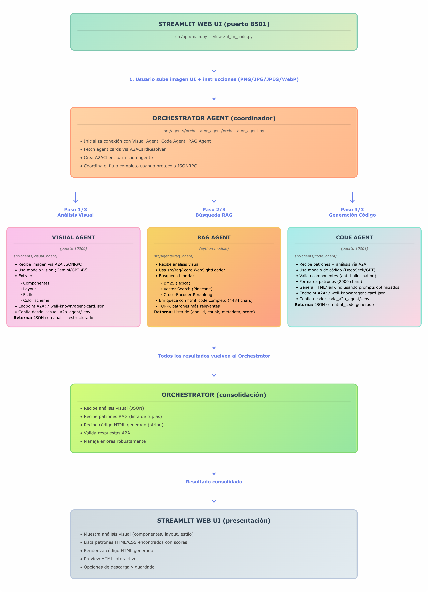
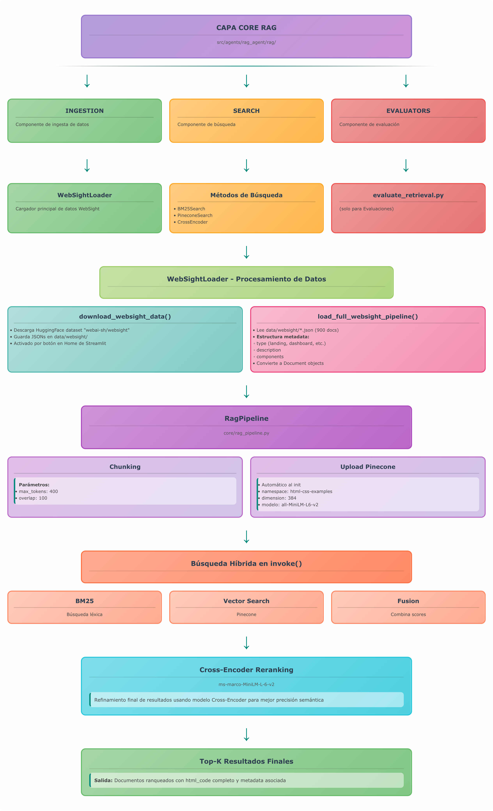

# <div align="center"><b> ⭐ Sistema Multi-Agente UI2Code ⭐ </b><br/>Trabajo Práctico Integrador - Procesamiento de Lenguaje Natural III<br/>Maestría en Inteligencia Artificial (FIUBA)</div>

<div align="center">✨Datos del proyecto:✨</div>

<p></p>

<div align="center">

| Subtitulo       | UI2Code                                                                                                                                                                                                                                                            |
| --------------- | ------------------------------------------------------------------------------------------------------------------------------------------------------------------------------------------------------------------------------------------------------------------ |
| **Descripción**  | UI2Code es un sistema avanzado que convierte diseños de interfaces <br/> de usuario en código  HTML/Tailwind CSS utilizando IA. Combina <br/> análisis visual inteligente con búsqueda semántica de patrones de <br/> código para generar código limpio y moderno. |
| **Integrantes**:  
                  - Noelia Melina Qualindi (noelia.qualindi@gmail.com)
                  - Fabricio Denardi (denardifabricio@gmail.com) 
                  - Jorge Ceferino Valdez (jorgecvaldez@gmail.com) 
                  - Bruno Masoller (brunomaso1@gmail.com)
</div>


## Inicio Rápido

### Opción 1: Docker Compose (Recomendado) 🚀

La forma más rápida de iniciar el sistema completo con un solo comando:

```bash
# Ejecutar el script de configuración e inicio automático
bash run.sh
```

**¿Qué hace este script?**
1. Verifica que Docker y Docker Compose estén instalados
2. Te guía en la configuración de variables de entorno:
   - `OPENROUTER_API_KEY` (para modelos de IA)
   - `GUARDRAILS_API_KEY` (para validación)
   - `OPENROUTER_VISUAL_MODEL` (modelo para análisis visual)
   - `OPENROUTER_CODE_MODEL` (modelo para generación de código)
   - `PINECONE_API_KEY` (para búsqueda vectorial)
3. Crea archivos `.env` en las ubicaciones correctas si no existen
4. Ejecuta `docker compose up --build` levantando:
   - **Visual Agent** (puerto 10000)
   - **Code Agent** (puerto 10001)
   - **Streamlit App** (puerto 8501)

Una vez iniciado, visita **http://localhost:8501** para acceder a la interfaz web.

⚠️ **Nota**: La primera ejecución puede tardar ~30 minutos descargando imágenes Docker (~30 GB).

### Opción 2: Instalación Manual (Sin Docker)

Si prefieres ejecutar el sistema sin Docker o para desarrollo local:

#### 2.1 Instalar dependencias

```bash
# Crear entorno virtual (recomendado)
python -m venv venv
source venv/bin/activate  # En Windows: venv\Scripts\activate

# Instalar con pip
pip install -e .

# O con make
make install

# Verificar que todo esté instalado
python check_deps.py
```

#### 2.2 Configurar variables de entorno

```bash
# Copiar plantilla
cp .env.example .env

# Editar .env y agregar tus claves API:
# - OPENROUTER_API_KEY (obtener en https://openrouter.ai/)
# - PINECONE_API_KEY (obtener en https://pinecone.io/)
# - GUARDRAILS_API_KEY (obtener en https://hub.guardrailsai.com/keys)
```

#### 2.3 Configurar Guardrails

```bash
guardrails configure
guardrails hub install hub://guardrails/regex_match
guardrails hub install hub://guardrails/valid_json
guardrails hub install hub://guardrails/web_sanitization
```

#### 2.4 Iniciar agentes manualmente

Abre 3 terminales diferentes y ejecuta:

```bash
# Terminal 1: Visual Agent
make run-visual-agent
# O: python -m src.agents.visual_agent

# Terminal 2: Code Agent
make run-code-agent
# O: python -m src.agents.code_agent

# Terminal 3: Streamlit
make run-server
# O: streamlit run src/app/main.py
```

Visita **http://localhost:8501** para acceder a la interfaz web.

### Modelos Recomendados

Si usas la opción manual (sin `run.sh`), configura estos modelos en tu `.env`:

```bash
# OpenRouter API Key (obtener en https://openrouter.ai/settings/keys)
OPENROUTER_API_KEY=sk-or-v1-tu_clave_aqui

# Modelos recomendados (gratuitos)
VISUAL_MODEL=google/gemini-2.0-flash-exp:free
CODE_MODEL=deepseek/deepseek-r1-distill-llama-70b:free

# Alternativas de pago (mejor calidad):
# VISUAL_MODEL=anthropic/claude-3.5-sonnet
# CODE_MODEL=deepseek/deepseek-r1

# Pinecone (obligatorio para búsqueda vectorial)
PINECONE_API_KEY=tu_clave_pinecone_aqui
PINECONE_INDEX=pln3-index

# Guardrails (obtener en https://hub.guardrailsai.com/keys)
GUARDRAILS_API_KEY=tu_clave_guardrails_aqui
```

**Nota**: Si usas `bash run.sh`, el script te guiará interactivamente para configurar todas estas claves.

## Características

### Conversión UI-to-Code
- **Análisis Visual con IA**: Análiza automáticamente diseños de UI usando modelos de visión artificial
- **Generación de Código Artesanal**: Produce HTML/Tailwind CSS limpio sin íconos de librerías externas
- **Búsqueda de Patrones Similares**: Encuentra ejemplos de código relacionados usando RAG híbrido
- **Interfaz Drag & Drop**: Sube imágenes de diseños y genera código al instante
- **Anti-Hallucination**: Validación automática para evitar generación de componentes no solicitados

### Sistema RAG Avanzado
- **Búsqueda Híbrida**: Combina BM25 (léxica) + búsqueda vectorial (semántica)
- **Re-ranking con Cross-Encoder**: Mejora la precisión de recuperación
- **Base de Conocimiento HTML/CSS**: 900+ documentos del dataset WebSight con patrones reales de código web
- **Integración con OpenRouter**: Soporte económico para modelos de IA (Gemini Flash, DeepSeek)
- **Carga Automática de Corpus**: Sistema auto-inicializable sin necesidad de comandos manuales

### Infraestructura Robusta
- **Interfaz Web Streamlit**: Interfaz interactiva multi-página
- **Configuración Dinámica**: Estructura flexible usando pyprojroot
- **Integración Pinecone**: Base de datos vectorial escalable con 900 patrones HTML/CSS (namespace: html-css-examples)
- **Sistema Multi-Agente A2A**: Protocolo Agent-to-Agent (JSONRPC) con agentes especializados
- **Monitoreo en Tiempo Real**: Dashboard de estado del sistema con métricas de corpus y agentes
- **Framework de Evaluación**: Sistema de evaluación de retrieval con métricas Precision@k, Recall@k, NDCG, MRR

## Arquitectura del Sistema Multi-Agente

El sistema implementa una arquitectura multi-agente coordinada mediante protocolo A2A (Agent-to-Agent) con JSONRPC:

### Diagrama de Flujo Completo

```
┌─────────────────────────────────────────────────────────────────────────────┐
│                       STREAMLIT WEB UI (puerto 8501)                        │
│                     src/app/main.py + views/ui_to_code.py                   │
└────────────────────────────────┬────────────────────────────────────────────┘
                                 │
                                 │ 1. Usuario sube imagen UI + instrucciones
                                 │    (PNG/JPG/JPEG/WebP)
                                 ▼
┌─────────────────────────────────────────────────────────────────────────────┐
│                    ORCHESTRATOR AGENT (coordinador)                         │
│              src/agents/orchestator_agent/orchestator_agent.py              │
│                                                                             │
│  • Inicializa conexión con Visual Agent, Code Agent, RAG Agent             │
│  • Fetch agent cards via A2ACardResolver                                   │
│  • Crea A2AClient para cada agente                                         │
│  • Coordina el flujo completo usando protocolo JSONRPC                     │
└───┬─────────────────────────┬─────────────────────────┬─────────────────────┘
    │                         │                         │
    │ Paso 1/3               │ Paso 2/3                │ Paso 3/3
    │ Análisis Visual        │ Búsqueda RAG            │ Generación Código
    │                         │                         │
    ▼                         ▼                         ▼
┌─────────────────────┐  ┌──────────────────────┐  ┌────────────────────────┐
│   VISUAL AGENT      │  │     RAG AGENT        │  │    CODE AGENT          │
│   (puerto 10000)    │  │   (python module)    │  │   (puerto 10001)       │
│                     │  │                      │  │                        │
│ src/agents/         │  │ src/agents/          │  │ src/agents/            │
│ visual_agent/       │  │ rag_agent/           │  │ code_agent/            │
│                     │  │                      │  │                        │
│ • Recibe imagen     │  │ • Recibe análisis    │  │ • Recibe patrones +    │
│   vía A2A JSONRPC   │  │   visual             │  │   análisis vía A2A     │
│                     │  │                      │  │                        │
│ • Usa modelo vision │  │ • Usa src/rag/ core  │  │ • Usa modelo de código │
│   (Gemini/GPT-4V)   │  │   WebSightLoader     │  │   (DeepSeek/GPT)       │
│                     │  │                      │  │                        │
│ • Extrae:           │  │ • Búsqueda híbrida:  │  │ • Valida componentes   │
│   - Componentes     │  │   ├─ BM25 (léxica)   │  │   (anti-hallucination) │
│   - Layout          │  │   ├─ Vector Search   │  │                        │
│   - Estilo          │  │   │   (Pinecone)     │  │ • Formatea patrones    │
│   - Color scheme    │  │   └─ Cross-Encoder   │  │   (2000 chars)         │
│                     │  │      Reranking       │  │                        │
│ • Endpoint A2A:     │  │                      │  │ • Genera HTML/Tailwind │
│   /.well-known/     │  │ • Enriquece con      │  │   usando prompts       │
│   agent-card.json   │  │   html_code completo │  │   optimizados          │
│                     │  │   (4484 chars)       │  │                        │
│ • Config desde:     │  │                      │  │ • Endpoint A2A:        │
│   visual_a2a_agent/ │  │ • TOP-K patrones     │  │   /.well-known/        │
│   .env              │  │   más relevantes     │  │   agent-card.json      │
│                     │  │                      │  │                        │
│ Retorna: JSON con   │  │ Retorna: Lista de    │  │ • Config desde:        │
│ análisis estructurado│  │ (doc_id, chunk,     │  │   code_a2a_agent/.env  │
└──────┬──────────────┘  │ metadata, score)    │  │                        │
       │                 └──────┬───────────────┘  │ Retorna: JSON con      │
       │                        │                  │ html_code generado     │
       │                        │                  └───────┬────────────────┘
       │                        │                          │
       └────────────────────────┴──────────────────────────┘
                                │
                                │ Todos los resultados vuelven al Orchestrator
                                ▼
┌─────────────────────────────────────────────────────────────────────────────┐
│                         ORCHESTRATOR (consolidación)                        │
│                                                                             │
│  • Recibe análisis visual (JSON)                                           │
│  • Recibe patrones RAG (lista de tuplas)                                   │
│  • Recibe código HTML generado (string)                                    │
│  • Valida respuestas A2A                                                   │
│  • Maneja errores robustamente                                             │
└────────────────────────────────┬────────────────────────────────────────────┘
                                 │
                                 │ Resultado consolidado
                                 ▼
┌─────────────────────────────────────────────────────────────────────────────┐
│                      STREAMLIT WEB UI (presentación)                        │
│                                                                             │
│  • Muestra análisis visual (componentes, layout, estilo)                   │
│  • Lista patrones HTML/CSS encontrados con scores                          │
│  • Renderiza código HTML generado                                          │
│  • Preview HTML interactivo                                                │
│  • Opciones de descarga y guardado                                         │
└─────────────────────────────────────────────────────────────────────────────┘
```




### Componentes del Sistema RAG (src/agents/rag_agent/rag/)

El flujo principal usa estos componentes específicos:

```
┌─────────────────────────────────────────────────────────────────────────────┐
│                    CAPA CORE RAG (src/agents/rag_agent/rag/)                │
└─────────────────────────────────────────────────────────────────────────────┘
                                 │
                 ┌───────────────┼───────────────┐
                 ▼               ▼               ▼
        ┌──────────────┐  ┌─────────────┐  ┌──────────────┐
        │  INGESTION   │  │    SEARCH   │  │  EVALUATORS  │
        └──────────────┘  └─────────────┘  └──────────────┘
                │                 │                 │
                ▼                 ▼                 ▼
         WebSightLoader    BM25Search         evaluate_retrieval.py
                │          PineconeSearch      (solo para Evaluaciones)
                │          CrossEncoder
                │
    ┌───────────┴──────────────────┐
    │                              │
    ▼                              ▼
download_websight_data()    load_full_websight_pipeline()
    │                              │
    │ Descarga HuggingFace         ├─ Lee data/websight/*.json (900 docs)
    │ dataset "webai-sh/websight" │
    │ y guarda JSONs en            ├─ Estructura metadata:
    │ data/websight/               │   - type (landing, dashboard, etc.)
    │                              │   - description
    │ Activado por botón en        │   - components
    │ Home de Streamlit            │
    │                              └─ Convierte a Document objects
    └──────────────┬───────────────────────┘
                   │
                   ▼
         RagPipeline (core/rag_pipeline.py)
                   │
       ┌───────────┴────────────┐
       │                        │
       ▼                        ▼
   Chunking               Upload Pinecone
   (max_tokens=400,       (automático al init)
    overlap=100)          namespace: html-css-examples
       │                  dimension: 384
       │                  (all-MiniLM-L6-v2)
       │
       └─────────┬──────────────┘
                 │
                 ▼
         Búsqueda Híbrida en invoke():
                 │
    ┌────────────┼────────────┐
    ▼            ▼            ▼
 BM25      Vector Search   Fusion
 (léxica)  (Pinecone)      (combina scores)
                 │
                 ▼
         Cross-Encoder Reranking
         (ms-marco-MiniLM-L-6-v2)
                 │
                 ▼
         Top-K resultados finales
         con html_code completo
```


**Nota**: PDFLoader existe en el código pero **NO se usa** en el flujo principal UI-to-Code. Solo aparece en páginas legacy de Streamlit (System Status, Corpus Information) para compatibilidad con corpus de PDFs antiguos.

### Explicación Detallada del Flujo

#### **Fase 0: Descarga de Dataset (opcional, desde Home)**
Si `data/websight/` está vacío, el usuario puede descargar el dataset desde la página Home:

1. Streamlit ejecuta `ensure_rag_ready()` en `main.py`
2. Si no hay documentos, muestra botón **"📦 Descargar dataset WebSight"**
3. Al hacer clic, llama `handle_download_websight_click()`:
   - Ejecuta `rag_agent.initialize_websight_rag_pipeline()`
   - Llama `_download_websight_dataset()` que usa `WebSightLoader.download_websight_data()`
   - Descarga dataset HuggingFace `"webai-sh/websight"` (~900 ejemplos HTML)
   - Guarda archivos JSON en `data/websight/`
   - Procesa JSONs y carga documentos
   - Crea RagPipeline y sube a Pinecone
4. Muestra "✅ WebSight listo e indexado"

#### **Fase 1: Inicialización (src/app/main.py)**
1. Streamlit carga y ejecuta `ensure_rag_ready()`
2. Se instancia `RAGAgent` que automáticamente:
   - Llama `_load_websight_html_examples()` que ejecuta `WebSightLoader.load_full_websight_pipeline()`
   - Lee 900 archivos JSON de `data/websight/`
   - Convierte a objetos `Document` con metadata completo
   - Crea `RagPipeline` con:
     - BM25Search (búsqueda léxica)
     - PineconeSearcher (búsqueda vectorial, namespace: `html-css-examples`)
     - Cross-Encoder (reranking: `ms-marco-MiniLM-L-6-v2`)
   - Chunking con `max_tokens=400`, `overlap=100`
   - Sube embeddings a Pinecone automáticamente (si no existen)
3. `OrchestratorAgent` se inicializa y fetch agent cards vía A2A protocol:
   - Resuelve `/.well-known/agent-card.json` para Visual Agent (puerto 10000)
   - Resuelve `/.well-known/agent-card.json` para Code Agent (puerto 10001)
   - Crea `A2AClient` para cada agente

#### **Fase 2: Análisis Visual (Paso 1/3)**
1. Usuario sube imagen en `views/ui_to_code.py`
2. Orchestrator llama `send_message_to_visual_agent(image_path)` vía A2A JSONRPC
3. Visual Agent (puerto 10000):
   - Carga modelo desde `.env` (`OPENROUTER_VISUAL_MODEL`)
   - Procesa imagen con modelo vision (Gemini 2.0 Flash / GPT-4V)
   - Extrae análisis estructurado: `{components: [], layout: str, style: str, color_scheme: str}`
4. Retorna análisis en formato JSON al Orchestrator

#### **Fase 3: Búsqueda RAG (Paso 2/3)**
1. Orchestrator pasa análisis a `RAGAgent.invoke(visual_analysis, top_k=5)`
2. RAG Agent ejecuta búsqueda híbrida en `RagPipeline`:
   - **BM25**: Búsqueda léxica en texto de documentos
   - **Vector Search**: Consulta embeddings en Pinecone (cosine similarity)
   - **Fusion**: Combina resultados con pesos (BM25 + Vector)
   - **Reranking**: Cross-encoder ordena candidatos por relevancia real
3. Para cada resultado, enriquece metadata con:
   - `html_code`: Código HTML completo del documento (hasta 4484 chars)
   - `doc_type`, `description`, `components` del documento original
4. Retorna top-k patrones: `[(doc_id, chunk, metadata, score), ...]`

#### **Fase 4: Generación de Código (Paso 3/3)**
1. Orchestrator llama `send_message_to_code_agent(patterns, analysis, custom_instructions)` vía A2A
2. Code Agent (puerto 10001):
   - Carga modelo desde `.env` (`OPENROUTER_CODE_MODEL`)
   - Formatea patrones con primeros 2000 caracteres de HTML
   - Construye prompt con:
     - Análisis visual (QUÉ generar)
     - Patrones HTML (CÓMO implementar técnicamente)
     - Instrucciones custom del usuario
     - Reglas anti-hallucination críticas
   - Genera código con modelo (DeepSeek R1 / GPT-4)
   - **Valida** con `_validate_html_components()`:
     - Detecta secciones extra (header, nav, footer, aside)
     - Compara con componentes del análisis visual
     - Logea warnings si hay alucinaciones
3. Retorna JSON: `{html_code: str, generation_metadata: dict}`

#### **Fase 5: Presentación (Streamlit)**
1. Orchestrator consolida todos los resultados
2. Streamlit renderiza:
   - **Análisis Visual**: Métricas de componentes, layout, estilo
   - **Patrones encontrados**: Expandibles con score y código HTML
   - **Código generado**: Editor de código con syntax highlighting
   - **Preview HTML**: Iframe interactivo con el resultado
3. Opcionalmente guarda artefactos en disco:
   - `save_generated_code()` → `outputs/generated_code_YYYYMMDD_HHMMSS.html`
   - `save_analysis_result()` → `outputs/analysis_YYYYMMDD_HHMMSS.json`

### Protocolos de Comunicación

- **Streamlit ↔ Orchestrator**: Llamadas Python directas (`asyncio`)
- **Orchestrator ↔ Visual Agent**: A2A JSONRPC sobre HTTP (puerto 10000)
- **Orchestrator ↔ Code Agent**: A2A JSONRPC sobre HTTP (puerto 10001)
- **Orchestrator ↔ RAG Agent**: Llamadas Python directas (módulo local)
- **RAG ↔ Pinecone**: gRPC (API de Pinecone)

### Componentes Principales

* **Visual Agent**: Utiliza modelos de visión (Gemini Flash, GPT-Vision) para análisis de imágenes UI
  - Puerto: 10000
  - Endpoint A2A: `/.well-known/agent-card.json`
  - Modelo configurable vía `VISUAL_MODEL` en `.env`

* **Code Agent**: Agente de generación de código (DeepSeek, GPT) que produce HTML/Tailwind CSS
  - Puerto: 10001
  - Endpoint A2A: `/.well-known/agent-card.json`
  - Modelo configurable vía `CODE_MODEL` en `.env`
  - Incluye validación anti-hallucination para detectar componentes extra no solicitados

* **RAG Agent**: Capa core que gestiona el corpus HTML/CSS
  - Carga automática de 900+ documentos del dataset WebSight desde `data/websight/`
  - Enriquecimiento de patrones con código HTML completo (hasta 4484 caracteres)
  - Upload automático a Pinecone en namespace `html-css-examples`

* **Orquestador A2A**: Coordina la comunicación entre agentes usando protocolo JSONRPC
  - Gestiona el flujo: Visual Agent → RAG Agent → Code Agent
  - Manejo de errores robusto con validación de respuestas

* **RAG Híbrido**: Combina BM25 (léxica) + Búsqueda Vectorial (semántica) + Cross-Encoder
  - Embeddings: sentence-transformers/all-MiniLM-L6-v2 (384 dimensiones)
  - Chunking inteligente con overlap para preservar contexto

* **WebSight Dataset Adapter**: Carga y procesa 900 ejemplos de HTML/CSS de HuggingFace
  - Lectura directa de archivos JSON desde `data/websight/`
  - Estructuración automática con metadata (type, description, components)

* **OpenRouter Integration**: Soporte para modelos económicos y de código abierto
  - Modelos recomendados: google/gemini-2.0-flash-exp:free, deepseek/deepseek-r1-distill-llama-70b:free

* **Pinecone Vector DB**: Almacena 900 embeddings de patrones HTML/CSS
  - Namespace: `html-css-examples`
  - Dimensión: 384 (all-MiniLM-L6-v2)

* **Guardrails**: Asegura que las salidas de los agentes cumplan con formatos y restricciones específicas

## Estructura principal del proyecto

```bash
ui2code-rag/
├── corpus/                      # Corpus de datos (Es un directorio legado del sistema original)
│   └── websight/                # Corpus WebSight (puede almacenar procesados) (Es un directorio legado del sistema original)
├── data/                        # Datos del sistema
│   ├── evaluate/                # Framework de evaluación de retrieval
│   │   ├── docs_ui_code_en.jsonl           # 9 documentos HTML para evaluación
│   │   ├── eval_retrieval_aggregated.csv   # Métricas agregadas (P@k, R@k, NDCG, MRR)
│   │   └── eval_retrieval_per_query.csv    # Resultados detallados por query
│   ├── generated_code/          # Códigos HTML generados por el sistema
│   │   ├── generated_YYYYMMDD_HHMMSS.html  # HTML generado
│   │   └── generated_YYYYMMDD_HHMMSS.json  # Metadata de generación
│   ├── temp_images/             # Imágenes temporales subidas + análisis
│   │   ├── upload_*.jpg         # Imágenes subidas por usuarios
│   │   └── analysis_*.json      # Análisis visuales guardados
│   └── websight/                # Corpus principal: 900 JSONs del dataset WebSight
│       ├── websight_0.json
│       ├── websight_100.json
│       └── ...                  # websight_200.json ... websight_900.json
├── docs/                        # Documentación y diagramas
│   ├── diagrama-flujo-arquitectura-multi-agente.png
│   └── diagrama-flujo-rag-pipeline.png
├── logs/                        # Logs del sistema (rotativos por fecha)
│   └── ui2code.YYYY-MM-DD.log
├── src/                         # Código fuente principal
│   ├── agents/                  # Capa de agentes multi-agente
│   │   ├── code_a2a_agent/      # Code Agent A2A (puerto 10001)
│   │   │   ├── .env             # Config: OPENROUTER_API_KEY, GUARDRAILS_API_KEY, OPENROUTER_CODE_MODEL
│   │   │   └── src/
│   │   │       ├── agent/code_agent.py      # Generación HTML + anti-hallucination
│   │   │       ├── texts/prompts.py         # Prompts optimizados con validación
│   │   │       └── config.py                # Lee CODE_MODEL de .env local
│   │   ├── code_agent/          # Code Agent legacy (no usado en producción)
│   │   ├── orchestator_agent/   # Orquestador A2A (coordina Visual + RAG + Code)
│   │   │   ├── orchestator_agent.py         # Lógica de coordinación JSONRPC
│   │   │   └── utils.py                     # Guardado de artefactos
│   │   ├── rag_agent/           # RAG Agent (búsqueda híbrida)
│   │   │   ├── rag_agent.py                 # Wrapper que carga WebSight
│   │   │   └── rag/                         # Core RAG (ingestion, search, eval)
│   │   │       ├── adapters/pinecone_adapter.py   # Pinecone vectorstore
│   │   │       ├── core/
│   │   │       │   ├── documents.py         # Modelo Document
│   │   │       │   ├── rag_pipeline.py      # Pipeline BM25 + Vector + Rerank
│   │   │       │   └── io_utils.py          # Load docs/qrels para eval
│   │   │       ├── ingestion/
│   │   │       │   ├── websight_loader.py   # Descarga + carga WebSight JSONs
│   │   │       │   └── pdf_loader.py        # Carga PDFs (legacy)
│   │   │       ├── search/
│   │   │       │   ├── bm25_search.py       # Búsqueda léxica
│   │   │       │   └── reranking.py         # Cross-encoder (ms-marco-MiniLM)
│   │   │       └── evaluators/
│   │   │           └── evaluate_retrieval.py # Métricas P@k, R@k, NDCG, MRR
│   │   ├── visual_a2a_agent/    # Visual Agent A2A (puerto 10000)
│   │   │   ├── .env             # Config: OPENROUTER_API_KEY, GUARDRAILS_API_KEY, OPENROUTER_VISUAL_MODEL
│   │   │   └── src/
│   │   │       ├── agent/visual_agent.py    # Análisis visual con LLM vision
│   │   │       └── config.py                # Lee VISUAL_MODEL de .env local
│   │   └── visual_agent/        # Visual Agent legacy (no usado en producción)
│   ├── app/                     # Aplicación Streamlit (puerto 8501)
│   │   ├── main.py              # Entry point + inicialización RAG
│   │   ├── pages/               # Páginas Streamlit
│   │   │   ├── 01_query_interface.py        # Búsqueda RAG + Prompt→HTML
│   │   │   ├── 02_ui_to_code.py             # UI-to-Code principal
│   │   │   ├── 03_evaluations.py            # Framework de evaluación
│   │   │   ├── 04_system_status.py          # Estado del sistema
│   │   │   └── 05_corpus_information.py     # Info del corpus
│   │   ├── services/            # Servicios de la app
│   │   │   ├── agents.py                    # get_orchestrator, get_rag_agent
│   │   │   └── rag_pipeline.py              # get_legacy_pdf_pipeline
│   │   ├── ui/                  # Componentes UI
│   │   │   ├── components/code_preview.py   # Preview HTML
│   │   │   ├── theme.py                     # Tema violeta custom
│   │   │   └── preloader.py                 # Splash screen
│   │   └── views/               # Vistas renderizadas por pages
│   │       ├── ui_to_code.py                # Lógica UI→Code
│   │       ├── evaluations.py               # Lógica evaluación
│   │       ├── system_status.py             # Lógica status
│   │       └── corpus_info.py               # Lógica corpus info
│   ├── common/                  # Utilidades comunes (io, telemetry, utils)
│   ├── config.py                # Configuración dinámica con pyprojroot
│   ├── config.yaml              # Config YAML (URLs agentes, timeouts)
│   ├── logging_config.py        # Config de logs (loguru)
│   ├── rag/                     # RAG core legacy (no usado, ver agents/rag_agent/rag/)
│   ├── runtime/                 # Runtime adapters y pipelines
│   ├── scripts/                 # Scripts utilitarios
│   │   └── download_websight.py             # Descarga WebSight desde HuggingFace
│   └── vectorstore/             # Chroma vectorstore (no usado, se usa Pinecone)
├── tests/                       # Tests del sistema
│   └── test_image.png           # Imagen de prueba
├── ui_examples/                 # 100 ejemplos HTML/JSON de WebSight (fallback)
│   ├── websight_000000.html
│   ├── websight_000000.json
│   └── ...                      # websight_000001 ... websight_000099
├── .env                         # Variables de entorno raíz (PINECONE_API_KEY)
├── .env.example                 # Template de variables de entorno
├── docker-compose.yaml          # Orquestación de contenedores Docker
├── Dockerfile                   # Imagen Docker del sistema
├── Makefile                     # Comandos del sistema
│   # make run-visual-agent      # Inicia Visual Agent A2A (puerto 10000)
│   # make run-code-agent        # Inicia Code Agent A2A (puerto 10001)
│   # make run-server            # Inicia Streamlit (puerto 8501)
├── pyproject.toml               # Configuración Poetry + dependencias
├── README.md                    # Este archivo
├── requirements.txt             # Dependencias pip (producción)
├── requirements-dev.txt         # Dependencias pip (desarrollo)
└── run.sh                       # Script de inicio automático con Docker Compose
```

## Instalación y Configuración

### Prerequisitos

**Si usas Docker (recomendado):**
- Docker y Docker Compose instalados
- No necesitas Python, dependencias, ni entornos virtuales locales

**Si instalas manualmente (sin Docker):**
- Python 3.10 - 3.12 (requerido: `>3.10, <3.13` según Streamlit)
- pip o uv para gestión de paquetes
- Entorno virtual (recomendado: venv o conda)

### Dependencias Principales

**Core del sistema:**
- `streamlit>=1.28.0` - Interfaz web interactiva
- `openai>=1.0.0` - Cliente API para OpenAI/OpenRouter
- `sentence-transformers>=5.1.1` - Embeddings para RAG (all-MiniLM-L6-v2)
- `pinecone>=3.0.0` - Base de datos vectorial
- `rank-bm25>=0.2.2` - Búsqueda BM25 léxica

**Procesamiento de datos:**
- `opencv-python>=4.12.0` - Visión por computadora (dev)
- `pillow>=10.1.0` - Manipulación de imágenes
- `beautifulsoup4>=4.12.0` - Parsing de HTML
- `numpy>=1.24.0` - Operaciones numéricas
- `pandas>=2.0.0` - Manipulación de datos

**Datasets y utilidades:**
- `datasets>=2.14.0` - Carga de WebSight dataset de HuggingFace
- `requests>=2.31.0` - Cliente HTTP
- `pdfplumber>=0.11.0` - Lectura de PDFs (legacy)

**Protocolo A2A y Guardrails:**
- `a2a-sdk>=0.3.8` - SDK para comunicación Agent-to-Agent (JSONRPC)
- `guardrails-ai>=0.6.7` - Framework de validación para outputs de IA (dev)
- `uvicorn>=0.37.0` - Servidor ASGI para agentes A2A (dev)
- `nest-asyncio>=1.6.0` - Soluciona asyncio anidado
- `loguru>=0.7.3` - Logging avanzado
- `pydantic-settings>=2.11.0` - Configuración basada en Pydantic (dev)

**Otros:**
- `python-dotenv>=1.0.0` - Carga de variables de entorno
- `pyyaml>=6.0.0` - Parsing de config.yaml
- `pyprojroot>=0.3.0` - Resolución de paths del proyecto

### Métodos de Instalación

#### Método 1: Usando pip (Instalación Manual)

```bash
# Crear entorno virtual
python -m venv venv
source venv/bin/activate  # En Windows: venv\Scripts\activate

# Instalar dependencias de producción
pip install -r requirements.txt

# O instalar con dependencias de desarrollo
pip install -r requirements-dev.txt

# O instalar como paquete editable (recomendado para desarrollo)
pip install -e .

# Configurar directorios del proyecto
python -c "from src.config import create_all_directories; create_all_directories()"
```

#### Método 2: Usando uv (Más rápido)

```bash
# Instalar uv si no lo tienes
curl -LsSf https://astral.sh/uv/install.sh | sh

# Crear entorno virtual y instalar dependencias
uv venv
source .venv/bin/activate  # En Windows: .venv\Scripts\activate
uv pip install -e .
```

### Configuración (Solo Instalación Manual)

**Nota**: Si usas Docker con `run.sh`, este script configura automáticamente todos los `.env` necesarios.

#### 1. Configurar Guardrails

```bash
# Ejecutar configuración de Guardrails
make run-guardrails-configuration

# O manualmente
guardrails configure
guardrails hub install hub://guardrails/regex_match
guardrails hub install hub://guardrails/valid_json
guardrails hub install hub://guardrails/web_sanitization
```

#### 2. Configurar Variables de Entorno

Necesitas crear **3 archivos .env** en las ubicaciones correctas:

**a) `.env` raíz (para Pinecone):**
```bash
cp .env.example .env
# Editar y agregar:
PINECONE_API_KEY=tu_clave_pinecone_aqui
PINECONE_INDEX=pln3-index
```

**b) `src/agents/visual_a2a_agent/.env` (para Visual Agent):**
```env
OPENROUTER_API_KEY=sk-or-v1-tu_clave_openrouter_aqui
GUARDRAILS_API_KEY=tu_clave_guardrails_aqui
OPENROUTER_VISUAL_MODEL=google/gemini-2.0-flash-exp:free
```

**c) `src/agents/code_a2a_agent/.env` (para Code Agent):**
```env
OPENROUTER_API_KEY=sk-or-v1-tu_clave_openrouter_aqui
GUARDRAILS_API_KEY=tu_clave_guardrails_aqui
OPENROUTER_CODE_MODEL=deepseek/deepseek-r1-distill-llama-70b:free
```

#### 3. Descargar Dataset WebSight (Opcional)

El dataset se descarga automáticamente desde la UI al iniciar, pero puedes pre-descargarlo:

```bash
# Descargar 1000 ejemplos del dataset WebSight
make download-websight

# O manualmente con curl
mkdir -p data/websight
curl -X GET "https://datasets-server.huggingface.co/rows?dataset=HuggingFaceM4%2FWebSight&config=v0.2&split=train&offset=0&length=100" -o data/websight/websight_0.json
# Repetir para offset 100, 200, 300... hasta 1000
```

## Uso

### 1. Iniciar el sistema completo

**Método recomendado: Docker Compose (script automatizado)**

```bash
# Ejecutar el script de inicio que configura todo automáticamente
bash run.sh
```

El script `run.sh` realiza las siguientes acciones:
1. Verifica que Docker y Docker Compose estén instalados
2. Crea/verifica archivos `.env` para cada agente:
   - `src/agents/visual_a2a_agent/.env` (OPENROUTER_API_KEY, GUARDRAILS_API_KEY, OPENROUTER_VISUAL_MODEL)
   - `src/agents/code_a2a_agent/.env` (OPENROUTER_API_KEY, GUARDRAILS_API_KEY, OPENROUTER_CODE_MODEL)
   - `.env` raíz (PINECONE_API_KEY)
3. Ejecuta `docker compose up --build` levantando:
   - Visual Agent (puerto 10000)
   - Code Agent (puerto 10001)
   - Streamlit App (puerto 8501)

**Método alternativo: Inicio manual (sin Docker)**

Si prefieres ejecutar sin Docker, inicia los agentes en terminales separadas:

```bash
# Terminal 1: Visual Agent (puerto 10000)
make run-visual-agent

# Terminal 2: Code Agent (puerto 10001)
make run-code-agent

# Terminal 3: Streamlit (puerto 8501)
make run-server
```

**Nota importante**: Los agentes leen configuración de modelos desde archivos `.env` específicos:
- Visual Agent: lee `OPENROUTER_VISUAL_MODEL` de `src/agents/visual_a2a_agent/.env`
- Code Agent: lee `OPENROUTER_CODE_MODEL` de `src/agents/code_a2a_agent/.env`
- Streamlit: lee `PINECONE_API_KEY` de `.env` raíz

### 2. Interfaz Web Streamlit

Una vez iniciado el sistema (con `bash run.sh` o manualmente), accede a la interfaz web en:

**http://localhost:8501**

La aplicación Streamlit (ubicada en `src/app/main.py`) proporciona cinco páginas principales:

#### 🏠 **Home**
- Dashboard principal con estado del sistema
- Inicialización automática del corpus HTML/CSS (900 documentos WebSight)
- Opción de descarga del dataset WebSight si no está disponible
- Navegación rápida a todas las funcionalidades

#### 🔍 **Query Interface**
- Búsqueda de patrones HTML/CSS usando RAG
- Modo "Prompt→HTML": genera código desde descripción textual
- Parámetros personalizables: top_k, re-ranking, resúmenes IA
- Visualización de resultados con código fuente completo

#### 🎨 **UI to Code**
- Conversión de imágenes de diseños UI a código HTML/Tailwind CSS
- Upload drag & drop de imágenes (PNG, JPG, JPEG, WebP)
- Instrucciones personalizadas opcionales (español/inglés)
- Análisis visual automático + búsqueda de patrones similares
- Generación de código con anti-hallucination validation
- Guardado automático de resultados con metadatos

#### 📏 **Evaluaciones**
- Framework completo de evaluación de retrieval
- Ejecución de métricas: **MRR, nDCG, Precision@k, Recall@k**
- Interfaz interactiva para configurar parámetros de evaluación
- Resultados por query y agregados (macro promedio)
- Descarga de resultados en formato CSV
- Dataset de evaluación incluido en `data/evaluate/`

#### 📊 **System Status**
- Estado de salud del sistema en tiempo real
- Métricas del corpus: documentos, chunks, índices
- Estado de agentes A2A (Visual Agent, Code Agent)
- Verificación de endpoints y conectividad
- Configuración actual del sistema

#### 📚 **Corpus Information**
- Explorador del corpus HTML/CSS (900 documentos)
- Metadatos de documentos: tipo, descripción, componentes
- Estadísticas de fragmentación y procesamiento
- Vista previa de código fuente

### 3. Uso de Evaluaciones

El sistema incluye una interfaz web completa para evaluar el rendimiento del retrieval:

1. Accede a la página **"Evaluaciones"** en el menú lateral
2. Configura los parámetros de evaluación:
   - **Docs JSONL**: `data/evaluate/docs_ui_code_en.jsonl` (9 documentos HTML)
   - **Qrels CSV**: `data/evaluate/qrels_ui_code_en.csv` (labels de relevancia)
   - **K's**: valores de k para métricas (ej: 3,5)
   - **top_retrieve**: candidatos a recuperar antes de reranking (5-200)
   - **top_final**: resultados finales después de reranking (1-50)
   - **Device**: auto/cpu/cuda/mps para procesamiento
3. Haz clic en **"🚀 Ejecutar evaluación"**
4. El sistema ejecuta automáticamente:
   - Carga de documentos y qrels
   - Indexación en Pinecone (namespace: `eval-metrics`)
   - Pipeline RAG con BM25 + Vector + Cross-Encoder
   - Cálculo de métricas MRR, nDCG, Precision@k, Recall@k
5. Visualiza resultados:
   - **Tabla por query**: métricas detalladas para cada query
   - **Tabla agregada**: promedios macro por valor de k
   - **Botones de descarga**: exporta resultados en CSV

**Métricas implementadas:**
- **MRR (Mean Reciprocal Rank)**: Prioriza si el documento relevante aparece en las primeras posiciones
- **nDCG (Normalized Discounted Cumulative Gain)**: Calidad del ranking considerando múltiples documentos relevantes
- **Precision@k**: Proporción de resultados relevantes en top-k
- **Recall@k**: Proporción de documentos relevantes recuperados en top-k


## Comandos Make Disponibles

El Makefile incluye los siguientes comandos útiles:

```bash
# Descargar dataset WebSight (1000 ejemplos desde HuggingFace)
make download-websight

# Configurar Guardrails
make run-guardrails-configuration

# Iniciar agentes A2A
make run-visual-agent     # Puerto 10000
make run-code-agent       # Puerto 10001

# Iniciar Streamlit
make run-server           # Puerto 8501

# Construir índice Pinecone (legacy, ahora automático)
make build-html

# Ejecutar evaluación de retrieval
make evaluate-retrieval
```

**Nota**: Los comandos `make test`, `make lint`, `make format`, `make clean` no están implementados en el Makefile actual.

## Evaluación

### Método 1: Interfaz Web (Recomendado)

Accede a la página **"Evaluaciones"** en Streamlit (http://localhost:8501) para:
- Configurar parámetros interactivamente
- Ejecutar evaluaciones con un clic
- Visualizar resultados en tablas interactivas
- Descargar resultados en CSV

### Método 2: Línea de Comandos

```bash
python -m src.agents.rag_agent.rag.evaluators.evaluate_retrieval \
  --docs data/evaluate/docs_ui_code_en.jsonl \
  --qrels data/evaluate/qrels_ui_code_en.csv \
  --ks 3,5 \
  --top_retrieve 10 \
  --top_final 5
```

### Dataset de Evaluación Incluido

El directorio `data/evaluate/` contiene:
- **docs_ui_code_en.jsonl**: 9 documentos HTML con descripciones de componentes UI
- **qrels_ui_code_en.csv**: Labels de relevancia query-documento (query, doc_id, label)
- **eval_retrieval_aggregated.csv**: Resultados agregados previos (P@k, R@k, NDCG, MRR)
- **eval_retrieval_per_query.csv**: Resultados detallados por query

### Métricas Evaluadas

- **Precision@k**: Proporción de resultados relevantes en los top-k recuperados
- **Recall@k**: Proporción de documentos relevantes totales recuperados en top-k
- **nDCG**: Ganancia acumulativa descontada normalizada (considera orden de ranking)
- **MRR**: Rango recíproco medio (prioriza primera posición relevante)

## Configuración Dinámica de Rutas

El sistema usa `pyprojroot` y configuración YAML para manejo flexible de rutas:

```python
from src.config import corpus_dir, processed_data_dir, get_path

# Usar rutas predefinidas
pdfs_path = corpus_dir()
results_path = get_path('outputs.results_dir', 'experiment_1')

# Las rutas son siempre relativas a la raíz del proyecto
```

## Guía de la Interfaz Web

### Interfaz de Consulta

**Uso paso a paso:**

1. **Ingresa tu pregunta** en el área de texto principal:
   ```
   Ejemplo: "¿Qué es RAG y cómo mejora las respuestas de IA?"
   ```

2. **Configura parámetros de búsqueda** en el panel de Configuraciones:
   - **Resultados principales a mostrar**: 5 (número de resultados finales a mostrar)
   - **Candidatos a recuperar**: 30 (candidatos recuperados antes del re-ranking)
   - **Usar re-ranking**: Habilitar para mejor precisión
   - **Incluir resumen**: Habilitar para resúmenes generados por IA

3. **Hacer clic en "Buscar"** para obtener resultados

4. **Revisar los resultados** que incluyen:
   - **Información de Consulta**: Metadatos y estadísticas de búsqueda
   - **Contexto de Resumen**: Resumen generado por IA (si está habilitado)
   - **Contexto Citado**: Contexto completo con citas de documentos
   - **Resultados de Búsqueda**: Resultados clasificados con puntuaciones y documentos fuente

**Nota**: Estas configuraciones proporcionan la misma funcionalidad de búsqueda híbrida con BM25 + búsqueda vectorial y re-ranking cross-encoder.

### Estado del Sistema
- Monitorear la salud general del sistema
- Verificar estadísticas del corpus de documentos
- Verificar el estado del índice de búsqueda
- Ver la configuración actual

### Información del Corpus
- Navegar todos los documentos en tu corpus
- Ver vistas previas de documentos y metadatos
- Verificar estadísticas de fragmentación
- Monitorear cambios en el corpus

## Solución de Problemas

### Problemas Comunes

1. **No se encontraron documentos**: Asegúrate de que los PDFs estén en el directorio `./corpus/`
2. **Errores de Pinecone**: Verifica la clave y región de Pinecone en `.env`
3. **Resultados pobres**: Ajusta los parámetros de tamaño de fragmento y solapamiento
4. **Alta latencia**: Reduce `top_retrieve` o usa un cross-encoder más ligero
5. **Dependencias faltantes**: Ejecuta `make install` o `pip install -e .`
6. **Problemas de Streamlit**: Verifica si el puerto 8501 está disponible

### Comandos de Debug

```bash
# Verificar rutas del proyecto
python -c "from src.config import project_dir, corpus_dir, websight_data_dir; print(f'Project: {project_dir()}'); print(f'Corpus: {corpus_dir()}'); print(f'WebSight: {websight_data_dir()}')"

# Verificar instalación de Streamlit
streamlit --version

# Verificar versión de Python
python --version

# Probar carga de RAG Agent
python -c "from src.agents.rag_agent.rag_agent import RAGAgent; agent = RAGAgent(); print('RAG Agent OK')"
```

## Guía de Inicio Rápido (Resumen)

### Opción A: Docker (Más Fácil)

```bash
git clone <tu-repo>
cd ui2code-rag
bash run.sh  # Configura y levanta todo automáticamente
# Abre http://localhost:8501
```

### Opción B: Manual

```bash
git clone <tu-repo>
cd ui2code-rag

# 1. Instalar dependencias
pip install -e .

# 2. Configurar Guardrails
make run-guardrails-configuration

# 3. Configurar .env (ver sección "Configuración")
cp .env.example .env
# Editar los 3 archivos .env necesarios

# 4. Descargar WebSight (opcional, se auto-descarga desde UI)
make download-websight

# 5. Iniciar agentes (3 terminales separadas)
make run-visual-agent   # Terminal 1
make run-code-agent     # Terminal 2
make run-server         # Terminal 3

# 6. Abrir navegador
# http://localhost:8501
```

### Comenzar a Usar

Una vez en http://localhost:8501:
- **"UI to Code"**: Sube imagen de diseño UI → genera HTML/Tailwind
- **"Query Interface"**: Busca patrones HTML o genera desde prompt
- **"Evaluaciones"**: Ejecuta métricas de retrieval (P@k, R@k, NDCG, MRR)
- **"System Status"**: Verifica estado de agentes y corpus
- **"Corpus Information"**: Explora los 900 documentos WebSight

## Ejemplos de Instrucciones Personalizadas

El sistema acepta instrucciones en **español o inglés** para personalizar el código generado:

### Ejemplos de Estilo
**Español:**
- `"Usar tema oscuro con acentos púrpura"`
- `"Crear diseño glassmorphism con efectos de desenfoque"`
- `"Aplicar diseño minimalista con mucho espacio en blanco"`
- `"Agregar fondo degradado de azul a púrpura"`

**English:**
- `"Use a dark theme with purple accents"`
- `"Create a glassmorphism design with blur effects"`
- `"Apply a minimalist design with lots of whitespace"`

### Ejemplos de Responsive
**Español:**
- `"Hacer completamente responsive con diseño mobile-first"`
- `"Agregar breakpoints para tablet y escritorio"`
- `"Optimizar para móvil con navegación colapsable"`

**English:**
- `"Make it fully responsive with mobile-first design"`
- `"Add breakpoints for tablet and desktop views"`

### Ejemplos de Interactividad
**Español:**
- `"Agregar efectos hover sutiles y animaciones"`
- `"Incluir estados de validación para formularios con colores de error"`
- `"Añadir estados de carga para botones y formularios"`

**English:**
- `"Add subtle hover effects and animations"`
- `"Include form validation styling with error states"`

### Ejemplos de Accesibilidad
**Español:**
- `"Añadir características de accesibilidad y etiquetas ARIA"`
- `"Incluir indicadores de foco para navegación por teclado"`
- `"Usar colores de alto contraste para mejor legibilidad"`

**English:**
- `"Add accessibility features and ARIA labels"`
- `"Include focus indicators for keyboard navigation"`

### Ejemplos de Estructura
**Español:**
- `"Crear layout basado en tarjetas con sombras"`
- `"Usar CSS Grid para el diseño principal"`
- `"Agregar header y footer fijos"`

**English:**
- `"Create a card-based layout with shadows"`
- `"Use CSS Grid for the main layout"`

### Ejemplos de Instrucciones Complejas

**Instrucciones combinadas en español:**
- `"Crear un diseño de dashboard responsive con sidebar colapsable, tema oscuro, tarjetas con sombras sutiles y efectos hover en todos los botones"`
- `"Hacer un formulario de registro con validación visual, campos flotantes, gradiente de fondo y animaciones suaves entre estados"`
- `"Diseñar una landing page minimalista con hero section, call-to-action prominente, tipografía grande y espaciado generoso"`

**Mixed language instructions:**
- `"Create a responsive navbar with burger menu para móvil, usar colores neutros y hover effects"`
- `"Make it accessible con ARIA labels y high contrast colors para better usability"`

## Lo que hace especial a este sistema

### Enfoque Artesanal
- **Sin íconos de librerías**: Evita FontAwesome, Heroicons, etc.
- **Sin símbolos Unicode decorativos**: No usa → ★ ✓ y similares
- **Diseño limpio y profesional**: Prefiere texto descriptivo y elementos geométricos simples
- **Tipografía como elemento de diseño**: Utiliza el texto de forma creativa

### IA Inteligente
- **Análisis visual avanzado**: Identifica función, no solo apariencia
- **Búsqueda semántica**: Encuentra patrones relevantes aunque sean visualmente diferentes
- **Generación contextual**: Combina análisis visual con patrones existentes
- **Personalización con texto**: Acepta instrucciones adicionales del usuario para customizar el código
- **Modelos económicos**: Utiliza OpenRouter para acceso rentable a IA de última generación

### Arquitectura Robusta
- **Sistema multi-agente**: Agentes especializados trabajando en conjunto
- **RAG híbrido probado**: Reutiliza infraestructura RAG robusta y optimizada
- **Base de conocimiento actualizable**: Fácil expansión con nuevos ejemplos HTML/CSS
- **Soporte multilingüe**: Instrucciones en español, inglés o ambos idiomas
- **Fallbacks inteligentes**: Funciona incluso sin claves API (con limitaciones)

## Licencia

Licencia MIT - ver archivo LICENSE para detalles.

## Contribuciones

1. Hacer fork del repositorio
2. Crear una rama de característica (`git checkout -b feature/nueva-funcionalidad`)
3. Hacer cambios con documentación y pruebas
4. Verificar que el código funciona correctamente:
   ```bash
   # Probar localmente
   make run-visual-agent  # Terminal 1
   make run-code-agent    # Terminal 2
   make run-server        # Terminal 3
   # Verificar en http://localhost:8501
   ```
5. Commit de cambios (`git commit -m "Add: nueva funcionalidad"`)
6. Push a la rama (`git push origin feature/nueva-funcionalidad`)
7. Abrir Pull Request con descripción detallada

## Documentación

- **Interfaz Web**: http://localhost:8501

Para guías detalladas, consulta la documentación del código fuente.

---

## Cambios y Mejoras Recientes

### Sistema de Corpus WebSight (900 documentos)

**Problema original**: El sistema cargaba solo 20 ejemplos hardcodeados en lugar de usar los 900 documentos reales del dataset WebSight.

**Solución implementada**:
- `src/rag/ingestion/websight_loader.py`: Modificado para leer archivos JSON reales desde `data/websight/`
- `src/agents/rag_agent/rag_agent.py`: Integración con WebSightLoader del core layer
- Los documentos ahora se cargan automáticamente al inicializar RAGAgent
- Upload automático a Pinecone en namespace `html-css-examples`
- Ya no es necesario el comando `make build-html`

### Enriquecimiento de Patrones HTML

**Mejora**: Los patrones recuperados ahora incluyen el código HTML completo (hasta 4484 caracteres) en lugar de solo 600 caracteres del chunk.

**Archivos modificados**:
- `src/agents/rag_agent/rag_agent.py`: Método `invoke()` enriquece metadata con `html_code` completo
- `src/agents/code_agent/src/agent/code_agent.py`: Usa 2000 caracteres de contexto HTML (antes 600)

### Validación Anti-Hallucination

**Problema**: El Code Agent generaba componentes no solicitados (ej: generar landing page completa cuando solo se pedía un formulario de login).

**Solución**:
- `src/agents/code_agent/src/texts/prompts.py`: Prompt reforzado con reglas críticas de validación
- `src/agents/code_agent/src/agent/code_agent.py`:
  - Método `_validate_html_components()` detecta secciones extra (header, nav, footer, aside)
  - Logging detallado cuando se detectan alucinaciones
  - Validación ejecutada después de cada generación

### Configuración de Modelos desde .env

**Problema**: Modelos hardcodeados en config.py causaban errores 404/429 cuando los modelos no estaban disponibles.

**Solución**:
- `src/agents/visual_agent/src/config.py`: Lee `VISUAL_MODEL` desde `.env` raíz
- `src/agents/code_agent/src/config.py`: Lee `CODE_MODEL` desde `.env` raíz
- Ambos agentes cargan `.env` raíz con prioridad sobre configs locales
- Modelos configurables sin modificar código

### Protocolo A2A Corregido

**Problema**: Endpoints A2A incorrectos causaban errores 404 en verificación de agentes.

**Solución**:
- `app/streamlit_app.py`: Actualizado a usar `/.well-known/agent-card.json` (endpoint correcto A2A)
- Verificación de estado de agentes ahora funciona correctamente

### Interfaz Streamlit Mejorada

**Actualizaciones en `app/streamlit_app.py`**:
- Dashboard principal muestra "900 documentos" en lugar de "20 ejemplos"
- System Status page actualizada con métricas correctas del corpus HTML/CSS
- Corpus Information page refleja dataset WebSight real
- Query Interface integrado con RAG Agent correcto
- Eliminados mensajes de error incorrectos sobre PDFs

### Manejo de Errores Robusto

**Mejoras en `src/agents/orchestator_agent/orchestator_agent.py`**:
- Eliminado método duplicado `send_prompt_to_code_agent`
- Try-catch robusto para RuntimeError en validación de respuestas
- Manejo de excepciones con mensajes de error informativos
- Logging detallado para debugging

### Configuración de Puertos

**Actualización en `src/config.yaml`**:
- Visual Agent: puerto 10000 (antes 3001)
- Code Agent: puerto 10001 (antes 3002)
- Streamlit: puerto 8501
- Consistencia entre config.yaml y agentes A2A

### Framework de Evaluación Integrado

**Nueva funcionalidad**:
- Página "Evaluaciones" en Streamlit (`src/app/pages/03_evaluations.py`)
- Interfaz interactiva para ejecutar evaluaciones de retrieval
- Dataset incluido en `data/evaluate/`:
  - 9 documentos HTML de prueba
  - Labels de relevancia query-documento
  - Resultados previos de evaluación
- Métricas: MRR, nDCG, Precision@k, Recall@k
- Exportación de resultados en CSV

### Arquitectura de Capas Clarificada

**Separación clara**:
- **`src/rag/`**: Capa core del sistema (WebSightLoader, RagPipeline, searchers)
- **`src/agents/`**: Capa de agentes que usa `src/rag/` (RAGAgent, VisualAgent, CodeAgent, Orchestrator)
- Los agentes siempre usan funciones de la capa core, no duplican lógica
- Flujo: Orchestrator → Visual Agent → RAG Agent (usa src/rag/) → Code Agent

### Mejoras en Prompts

**`src/agents/code_agent/src/texts/prompts.py`**:
- Énfasis en generar SOLO componentes mencionados en análisis visual
- Advertencias críticas contra alucinaciones
- Ejemplos concretos de qué generar vs qué NO generar
- Instrucciones para usar patrones como referencia técnica, no como base literal
- Soporte bilingüe (español/inglés) clarificado

---

## Troubleshooting de Cambios Recientes

### Si no ves 900 documentos en el corpus:

1. Verifica que `data/websight/` contenga archivos JSON
2. Si está vacío, ejecuta: `python download_websight.py`
3. Reinicia Streamlit - el corpus se carga automáticamente

### Si los agentes no inician:

1. Verifica archivos `.env`:
   - `src/agents/visual_a2a_agent/.env` debe tener `OPENROUTER_VISUAL_MODEL`
   - `src/agents/code_a2a_agent/.env` debe tener `OPENROUTER_CODE_MODEL`
   - `.env` raíz debe tener `PINECONE_API_KEY`
2. Usa `bash run.sh` para configuración automática

### Si hay alucinaciones en código generado:

- Revisa logs del Code Agent - debe mostrar warnings de validación
- Verifica que el análisis visual sea preciso
- Considera usar modelos más potentes (DeepSeek R1 70B, Claude 3.5)

### Si Pinecone no funciona:

1. Verifica `PINECONE_API_KEY` en `.env` raíz
2. Confirma que el índice existe y acepta dimensión 384
3. Namespace usado: `html-css-examples` (corpus) y `eval-metrics` (evaluación)