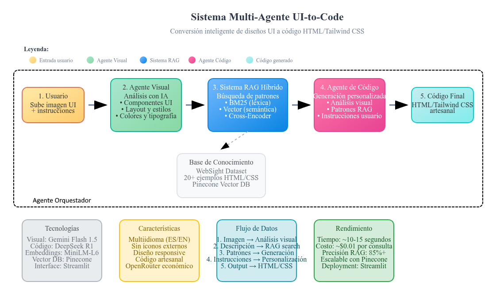

# <div align="center"><b> ⭐ Sistema Multi-Agente UI2Code ⭐ </b><br/>Trabajo Práctico Integrador - Procesamiento de Lenguaje Natural III<br/>Maestría en Inteligencia Artificial (FIUBA)</div>

<div align="center">✨Datos del proyecto:✨</div>

<p></p>

<div align="center">

| Subtitulo       | UI2Code                                                                                                                                                                                                                                                            |
| --------------- | ------------------------------------------------------------------------------------------------------------------------------------------------------------------------------------------------------------------------------------------------------------------ |
| **Descrpción**  | UI2Code es un sistema avanzado que convierte diseños de interfaces <br/> de usuario en código  HTML/Tailwind CSS utilizando IA. Combina <br/> análisis visual inteligente con búsqueda semántica de patrones de <br/> código para generar código limpio y moderno. |
| **Integrantes** | -Noelia Melina Qualindi (noelia.qualindi@gmail.com)<br/> - Fabricio Denardi (denardifabricio@gmail.com)<br/> - Jorge Ceferino Valdez (jorgecvaldez@gmail.com)<br/> -Bruno Masoller (brunomaso1@gmail.com)                                                          |

</div>


## Inicio Rápido
<!-- TODO: Actualizar instrucciones de inicio rápido, así como adaptar Makefile (o mejorar con Docker-compose?) -->

```bash
# Opción 1: Script automático
python quick_start.py # TODO: No funciona por ahora.

# Opción 2: Configuración manual
pip install -e .
cp .env.example .env
# 2.1 Editar .env con tus claves API (OpenRouter recomendado)

# Configurar guardrails
guardrails configure

guardrails hub install hub://guardrails/regex_match

guardrails hub install hub://guardrails/valid_json

guardrails hub install hub://guardrails/web_sanitization

python run_streamlit.py

# Opción 3: Verificar dependencias
python check_deps.py  # Verificar que todo esté instalado
```

### Configuración API (Recomendada)

```bash
# 1. Obtener clave de OpenRouter (económico)
# Visita: https://openrouter.ai/

# 2. Editar .env
OPENROUTER_API_KEY=sk-or-v1-tu_clave_aqui
VISUAL_MODEL=google/gemini-flash-1.5
CODE_MODEL=deepseek/deepseek-r1-distill-llama-8b
# Alternative: CODE_MODEL=deepseek/deepseek-r1-distill-llama-70b:free

# 3. Opcional: Pinecone para mejor búsqueda
PINECONE_API_KEY=tu_clave_pinecone_aqui
```

Visita **http://localhost:8501** para acceder a la interfaz web interactiva.

## Características

### Conversión UI-to-Code
- **Análisis Visual con IA**: Análiza automáticamente diseños de UI usando modelos de visión artificial
- **Generación de Código Artesanal**: Produce HTML/Tailwind CSS limpio sin íconos de librerías externas
- **Búsqueda de Patrones Similares**: Encuentra ejemplos de código relacionados usando RAG híbrido
- **Interfaz Drag & Drop**: Sube imágenes de diseños y genera código al instante

### Sistema RAG Avanzado
- **Búsqueda Híbrida**: Combina BM25 (léxica) + búsqueda vectorial (semántica)
- **Re-ranking con Cross-Encoder**: Mejora la precisión de recuperación
- **Base de Conocimiento HTML/CSS**: Corpus especializado en ejemplos de código web
- **Integración con OpenRouter**: Soporte económico para modelos de IA (Gemini Flash, DeepSeek)

### Infraestructura Robusta
- **Interfaz Web Streamlit**: Interfaz interactiva multi-página
- **Configuración Dinámica**: Estructura flexible usando pyprojroot
- **Integración Pinecone**: Base de datos vectorial escalable para búsqueda semántica
- **Sistema Multi-Agente A2A**: Agente Visual + Agente de Código trabajando en conjunto por medio de un orquestador
- **Monitoreo en Tiempo Real**: Dashboard de estado del sistema

## Arquitectura

El sistema implementa un flujo multi-agente especializado en UI-to-Code:

> [!NOTE]
> Imagen UI + Instrucciones Usuario → Análisis Visual (Gemini/GPT-Vision) → Búsqueda RAG Híbrida (BM25 + Vector + Cross-Encoder) → Patrones HTML/CSS → Generación Personalizada (DeepSeek/GPT) → Código HTML/Tailwind Customizado

## Workflow del sistema

<!-- TODO: Actualizar diagrama de workflow, incluir A2A. -->


### Flujo de Trabajo
1. **Carga de Imagen**: Usuario sube diseño de interfaz
2. **Instrucciones Personalizadas**: Usuario especifica requerimientos adicionales (opcional)
3. **Agente Visual**: Analiza componentes, layout y estilo usando IA de visión
4. **Búsqueda RAG**: Encuentra patrones similares en base de conocimiento HTML/CSS
5. **Agente de Código**: Genera código personalizado basado en análisis, patrones e instrucciones del usuario
6. **Salida Final**: Código HTML/Tailwind CSS customizado y listo para usar

### Componentes Principales

* **Visual Agent**: Utiliza modelos de visión (Gemini Flash, GPT-Vision) para análisis de imágenes UI
* **Code Agent**: Agente de generación de código (DeepSeek, GPT) que produce HTML/Tailwind CSS
* **Orquestador A2A**: Coordina la comunicación entre agentes y el flujo de datos. Se encarga del RAG híbrido
* **RAG Híbrido**: Combina BM25 (léxica) + Búsqueda Vectorial (semántica) + Cross-Encoder
* **WebSight Dataset Adapter**: Carga y procesa ejemplos de HTML/CSS para la base de conocimiento
* **OpenRouter Integration**: Soporte para modelos económicos y de código abierto
* **Pinecone Vector DB**: Almacena embeddings para búsqueda semántica eficiente
* **Guardrails**: Asegura que las salidas de los agentes cumplan con formatos y restricciones específicas

## Estructura principal del proyecto

```bash
Ui2Code/
├── app                          # Aplicación Streamlit
│   └── streamlit_app.py         # Aplicación principal del sistema
├── corpus                       # Conjunto de documentos para el sistema
├── data                         # Datos utilizados por el sistema
├── docs                         # Documentación del sistema
├── logs                         # Archivos de registro del sistema
├── src                          # Código fuente del sistema/
│   ├── agents                   # Agentes del sistema/
│   │   ├── code_agent           # Agente de código
│   │   ├── orchestator_agent    # Agente orquestador
│   │   ├── rag_agent            # Agente RAG
│   │   └── visual_agent         # Agente visual
│   ├── rag                      # Sistema RAG
│   ├── runtime                  # Entorno de ejecución
│   ├── config.py                # Configuración del sistema
│   ├── config.yaml              # Configuración del sistema
│   └── logging_config.py        # Configuración de registro
├── tests                        # Pruebas del sistema
├── ui_examples                  # Ejemplos de interfaz de usuario
├── .env.example                 # Archivo de ejemplo de variables de entorno
├── check_deps.py                # Verificación de dependencias
├── download_websight.py         # Descarga de datos de WebSight
├── Makefile                     # Archivo Makefile
├── poetry.lock                  # Archivo de fijación de dependencias de Poetry
├── pyproject.toml               # Archivo de configuración de Poetry
├── quick_start.py               # Guía de inicio rápido
├── README.md                    # Archivo README
├── requirements-dev.txt         # Dependencias de desarrollo
├── requirements.txt             # Dependencias de producción
├── run_streamlit.py             # Ejecutar la aplicación Streamlit
└── setup.py                     # Script de configuración
```

<!--  https://tree.nathanfriend.com/
Ui2Code
  app                     
    streamlit_app.py      # Aplicación principal del sistema
  corpus                   # Conjunto de documentos para el sistema
  data                     # Datos utilizados por el sistema
  docs                     # Documentación del sistema
  logs                     # Archivos de registro del sistema
  src                      # Código fuente del sistema
    agents                 # Agentes del sistema
      code_agent           # Agente de código
      orchestator_agent    # Agente orquestador
      rag_agent            # Agente RAG
      visual_agent         # Agente visual
    rag                     # Sistema RAG
    runtime                 # Entorno de ejecución
    config.py               # Configuración del sistema
    config.yaml             # Configuración del sistema
    logging_config.py       # Configuración de registro
  tests                     # Pruebas del sistema
  ui_examples               # Ejemplos de interfaz de usuario
  .env.example              # Archivo de ejemplo de variables de entorno
  check_deps.py             # Verificación de dependencias
  download_websight.py      # Descarga de datos de WebSight
  Makefile                  # Archivo Makefile
  poetry.lock               # Archivo de fijación de dependencias de Poetry
  pyproject.toml            # Archivo de configuración de Poetry
  quick_start.py            # Guía de inicio rápido
  README.md                 # Archivo README
  requirements-dev.txt      # Dependencias de desarrollo
  requirements.txt          # Dependencias de producción
  run_streamlit.py          # Ejecutar la aplicación Streamlit
  setup.py                  # Script de configuración
 -->

## Instalación y Configuración

### Prerequisitos

- Python 3.9+ (recomendado 3.10 o superior)
- Entorno virtual (recomendado)

### Dependencias Principales

**Core del sistema:**
- `streamlit>=1.28.0` - Interfaz web interactiva
- `openai>=1.0.0` - Cliente API para OpenAI/OpenRouter
- `sentence-transformers>=2.2.0` - Embeddings para RAG
- `pinecone>=3.0.0` - Base de datos vectorial

**Procesamiento de imágenes:**
- `opencv-python>=4.8.0` - Visión por computadora
- `pillow>=10.1.0` - Manipulación de imágenes
- `beautifulsoup4>=4.12.0` - Parsing de HTML

**Datasets y utilidades:**
- `datasets>=2.14.0` - Carga de WebSight dataset
- `requests>=2.31.0` - Cliente HTTP

**A2A y Guardrails:**
- `guardrails-ai>=0.6.6` - Framework de guardrails para IA
- `click >=8.3.0<9.0.0)` - CLI para Python
- `httpx >=0.28.1<0.29.0)` - Cliente HTTP asíncrono
- `pydantic >=2.11.9<3.0.0)` - Validación de datos
- `uvicorn >=0.37.0<0.38.0)` - Servidor ASGI
- `sse-starlette >=3.0.2<4.0.0)` - SSE para Starlette
- `starlette >=0.48.0<0.49.0)` - Servidor
- `a2a-sdk >=0.3.6<0.4.0)` - SDK para agentes A2A
- `nest-asyncio >=1.6.0<2.0.0)` - Soluciona asincrónica anidada
- `loguru >=0.7.3<0.8.0)` - Logging avanzado
- `pydantic-settings >=2.11.0<3.0.0)` - Configuración basada en Pydantic

### Métodos de Instalación

#### Método 1: Usando Make (Recomendado)

```bash
make quick-start  # Muestra la guía completa de configuración
make install      # Instalar dependencias
make setup-dirs   # Crear estructura de directorios
```

#### Método 2: Instalación Manual

```bash
# Crear entorno virtual
python -m venv venv
source venv/bin/activate  # En Windows: venv\Scripts\activate

# Instalar dependencias
pip install -e .

# Configurar directorios del proyecto
python -c "from src.config import create_all_directories; create_all_directories()"
```

### Configuración

1. **Copiar plantilla de entorno**:
   ```bash
   cp .env.example .env
   ```

2. **Configurar claves API** (editar .env):
   ```env
   # OpenRouter (recomendado para UI-to-Code)
   OPENROUTER_API_KEY=sk-or-v1-tu_clave_openrouter_aqui
   VISUAL_MODEL=google/gemini-flash-1.5
   CODE_MODEL=deepseek/deepseek-r1-distill-llama-8b
   # Alternative models:
   # CODE_MODEL=deepseek/deepseek-r1-distill-llama-70b:free (más potente, gratis)
   
   # Pinecone (opcional pero recomendado)
   PINECONE_API_KEY=tu_clave_pinecone_aqui
   PINECONE_INDEX=rag-index
   
   # OpenAI (alternativo)
   OPENAI_API_KEY=sk-tu_clave_openai_aqui
   ```

3. **Verificar configuración**:
   ```bash
   make check-config
   ```

## Uso

### 1. Iniciar los agentes

Iniciar los agentes de forma manual:

```bash
python -m src.agents.visual_agent
python -m src.agents.code_rag_agent
```

### 2. Interfaz Web Streamlit (Recomendado)

Iniciar la aplicación web Streamlit:

```bash
# Usando el script lanzador
python run_streamlit.py

# O directamente con streamlit
streamlit run app/main.py
```

La interfaz web proporciona cuatro páginas principales:

- **UI to Code**: Convierte imágenes de diseños UI a código HTML/Tailwind CSS
- **Query Interface**: Búsqueda RAG tradicional con parámetros personalizables  
- **System Status**: Salud del sistema y configuración en tiempo real
- **Corpus Information**: Visión general del corpus (PDFs + HTML/CSS examples)

### 2. UI-to-Code: Conversión de Imágenes

**Página principal del sistema**. Te permite:

1. **Subir imagen** de diseño UI (PNG, JPG, JPEG, WebP)
2. **Agregar instrucciones personalizadas** (opcional - **español o inglés**):
   - Ejemplos predefinidos: "Tema oscuro", "Diseño responsive", "Efectos hover"
   - Instrucciones libres: "Agregar efectos glassmorphism", "Usar características de accesibilidad"
3. **Análisis automático** con IA de visión que identifica:
   - Componentes (botones, formularios, cards, etc.)
   - Layout (grid, flexbox, columnas)
   - Estilo visual (colores, tipografía, spacing)
4. **Búsqueda de patrones** similares en base de conocimiento HTML/CSS
5. **Generación de código** HTML/Tailwind CSS personalizado según tus instrucciones
6. **Guardado automático** de resultados con metadatos de instrucciones utilizadas

### 3. Funciones RAG Tradicionales

Las páginas de consulta RAG permiten:

- **Búsquedas sobre corpus** de documentos PDF y HTML/CSS
- **Parámetros configurables**: top_k, candidatos, re-ranking, resúmenes IA
- **Resultados detallados**: fuentes, puntuaciones, contexto, metadatos
- **Sistema híbrido**: BM25 + Vector search + Cross-Encoder re-ranking

### 4. Monitoreo del Sistema

Monitorea tu sistema RAG a través de:

- **Estado del Corpus**: Conteo de documentos, estadísticas de fragmentos
- **Salud del Índice**: Preparación de búsqueda BM25 y vectorial
- **Configuración**: Configuraciones y rutas actuales
- **Explorador de Documentos**: Navegar documentos individuales y vistas previas

### 4. Interfaz de Programación

También puedes usar el sistema RAG programáticamente:

<!-- TODO: Actualizar ejemplo de uso programático. -->
```python
from src.rag.core.rag_pipeline import RagPipeline
from src.rag.ingestion.pdf_loader import folder_pdfs_to_documents
from src.config import corpus_dir

# Cargar documentos
docs = folder_pdfs_to_documents(corpus_dir())

# Crear pipeline
pipeline = RagPipeline(docs)

# Consultar
results = pipeline.retrieve_and_rerank("Tu pregunta aquí")
context = pipeline.build_cited_context(results)
print(context)
```

## Pruebas y Desarrollo

```bash
make test         # Ejecutar pruebas
make lint         # Linting de código
make format       # Formateo de código
make clean        # Limpiar archivos cache
```

## Evaluación

Evalúa el rendimiento de recuperación con datos de verdad fundamental:

```bash
python -m src.rag.evaluators.evaluate_retrieval --docs data/docs_ui_code_en.jsonl --qrels data/qrels_ui_code_en.csv --ks 3,5 --top_retrieve 10 --top_final 5
```

Las métricas incluyen:
- **Precision@k**: Resultados relevantes en top-k
- **Recall@k**: Documentos relevantes recuperados
- **nDCG**: Ganancia acumulativa descontada normalizada
- **MRR**: Rango recíproco medio

## Configuración Dinámica de Rutas

El sistema usa `pyprojroot` y configuración YAML para manejo flexible de rutas:

```python
from src.config import corpus_dir, processed_data_dir, get_path

# Usar rutas predefinidas
pdfs_path = corpus_dir()
results_path = get_path('outputs.results_dir', 'experiment_1')

# Las rutas son siempre relativas a la raíz del proyecto
```

## Guía de la Interfaz Web

### Interfaz de Consulta

**Uso paso a paso:**

1. **Ingresa tu pregunta** en el área de texto principal:
   ```
   Ejemplo: "¿Qué es RAG y cómo mejora las respuestas de IA?"
   ```

2. **Configura parámetros de búsqueda** en el panel de Configuraciones:
   - **Resultados principales a mostrar**: 5 (número de resultados finales a mostrar)
   - **Candidatos a recuperar**: 30 (candidatos recuperados antes del re-ranking)
   - **Usar re-ranking**: Habilitar para mejor precisión
   - **Incluir resumen**: Habilitar para resúmenes generados por IA

3. **Hacer clic en "Buscar"** para obtener resultados

4. **Revisar los resultados** que incluyen:
   - **Información de Consulta**: Metadatos y estadísticas de búsqueda
   - **Contexto de Resumen**: Resumen generado por IA (si está habilitado)
   - **Contexto Citado**: Contexto completo con citas de documentos
   - **Resultados de Búsqueda**: Resultados clasificados con puntuaciones y documentos fuente

**Nota**: Estas configuraciones proporcionan la misma funcionalidad de búsqueda híbrida con BM25 + búsqueda vectorial y re-ranking cross-encoder.

### Estado del Sistema
- Monitorear la salud general del sistema
- Verificar estadísticas del corpus de documentos
- Verificar el estado del índice de búsqueda
- Ver la configuración actual

### Información del Corpus
- Navegar todos los documentos en tu corpus
- Ver vistas previas de documentos y metadatos
- Verificar estadísticas de fragmentación
- Monitorear cambios en el corpus

## Solución de Problemas

### Problemas Comunes

1. **No se encontraron documentos**: Asegúrate de que los PDFs estén en el directorio `./corpus/`
2. **Errores de Pinecone**: Verifica la clave y región de Pinecone en `.env`
3. **Resultados pobres**: Ajusta los parámetros de tamaño de fragmento y solapamiento
4. **Alta latencia**: Reduce `top_retrieve` o usa un cross-encoder más ligero
5. **Dependencias faltantes**: Ejecuta `make install` o `pip install -e .`
6. **Problemas de Streamlit**: Verifica si el puerto 8501 está disponible

### Comandos de Debug

```bash
make check-config    # Verificar configuración
make verify-env      # Verificar entorno Python
python -c "from src.config import project_dir; print(project_dir())"
streamlit --version  # Verificar instalación de Streamlit
```

## Guía de Inicio

1. **Clonar y Configurar**:
   ```bash
   git clone <tu-repo>
   cd ui-to-code-system
   make install
   ```

2. **Añadir Tus Documentos**:
   ```bash
   cp tus_pdfs/* corpus/
   ```

3. **Configurar Servicios** (Opcional pero recomendado):
   ```bash
   cp .env.example .env
   # Editar .env con tus claves de OpenAI y Pinecone
   ```

4. **Lanzar la Interfaz**:
   ```bash
   python run_streamlit.py
   ```

5. **Comenzar a usar**: Abre http://localhost:8501 y:
   - Ve a "UI to Code" para convertir imágenes a código HTML/CSS
   - Usa "Query Interface" para búsquedas RAG tradicionales

## Ejemplos de Instrucciones Personalizadas

El sistema acepta instrucciones en **español o inglés** para personalizar el código generado:

### Ejemplos de Estilo
**Español:**
- `"Usar tema oscuro con acentos púrpura"`
- `"Crear diseño glassmorphism con efectos de desenfoque"`
- `"Aplicar diseño minimalista con mucho espacio en blanco"`
- `"Agregar fondo degradado de azul a púrpura"`

**English:**
- `"Use a dark theme with purple accents"`
- `"Create a glassmorphism design with blur effects"`
- `"Apply a minimalist design with lots of whitespace"`

### Ejemplos de Responsive
**Español:**
- `"Hacer completamente responsive con diseño mobile-first"`
- `"Agregar breakpoints para tablet y escritorio"`
- `"Optimizar para móvil con navegación colapsable"`

**English:**
- `"Make it fully responsive with mobile-first design"`
- `"Add breakpoints for tablet and desktop views"`

### Ejemplos de Interactividad
**Español:**
- `"Agregar efectos hover sutiles y animaciones"`
- `"Incluir estados de validación para formularios con colores de error"`
- `"Añadir estados de carga para botones y formularios"`

**English:**
- `"Add subtle hover effects and animations"`
- `"Include form validation styling with error states"`

### Ejemplos de Accesibilidad
**Español:**
- `"Añadir características de accesibilidad y etiquetas ARIA"`
- `"Incluir indicadores de foco para navegación por teclado"`
- `"Usar colores de alto contraste para mejor legibilidad"`

**English:**
- `"Add accessibility features and ARIA labels"`
- `"Include focus indicators for keyboard navigation"`

### Ejemplos de Estructura
**Español:**
- `"Crear layout basado en tarjetas con sombras"`
- `"Usar CSS Grid para el diseño principal"`
- `"Agregar header y footer fijos"`

**English:**
- `"Create a card-based layout with shadows"`
- `"Use CSS Grid for the main layout"`

### Ejemplos de Instrucciones Complejas

**Instrucciones combinadas en español:**
- `"Crear un diseño de dashboard responsive con sidebar colapsable, tema oscuro, tarjetas con sombras sutiles y efectos hover en todos los botones"`
- `"Hacer un formulario de registro con validación visual, campos flotantes, gradiente de fondo y animaciones suaves entre estados"`
- `"Diseñar una landing page minimalista con hero section, call-to-action prominente, tipografía grande y espaciado generoso"`

**Mixed language instructions:**
- `"Create a responsive navbar with burger menu para móvil, usar colores neutros y hover effects"`
- `"Make it accessible con ARIA labels y high contrast colors para better usability"`

## Lo que hace especial a este sistema

### Enfoque Artesanal
- **Sin íconos de librerías**: Evita FontAwesome, Heroicons, etc.
- **Sin símbolos Unicode decorativos**: No usa → ★ ✓ y similares
- **Diseño limpio y profesional**: Prefiere texto descriptivo y elementos geométricos simples
- **Tipografía como elemento de diseño**: Utiliza el texto de forma creativa

### IA Inteligente
- **Análisis visual avanzado**: Identifica función, no solo apariencia
- **Búsqueda semántica**: Encuentra patrones relevantes aunque sean visualmente diferentes
- **Generación contextual**: Combina análisis visual con patrones existentes
- **Personalización con texto**: Acepta instrucciones adicionales del usuario para customizar el código
- **Modelos económicos**: Utiliza OpenRouter para acceso rentable a IA de última generación

### Arquitectura Robusta
- **Sistema multi-agente**: Agentes especializados trabajando en conjunto
- **RAG híbrido probado**: Reutiliza infraestructura RAG robusta y optimizada
- **Base de conocimiento actualizable**: Fácil expansión con nuevos ejemplos HTML/CSS
- **Soporte multilingüe**: Instrucciones en español, inglés o ambos idiomas
- **Fallbacks inteligentes**: Funciona incluso sin claves API (con limitaciones)

## Licencia

Licencia MIT - ver archivo LICENSE para detalles.

## Contribuciones

1. Hacer fork del repositorio
2. Crear una rama de característica
3. Hacer cambios con pruebas
4. Ejecutar `make format lint test`
5. Enviar pull request

## Documentación

- **Interfaz Web**: http://localhost:8501

Para guías detalladas, consulta la documentación del código fuente.