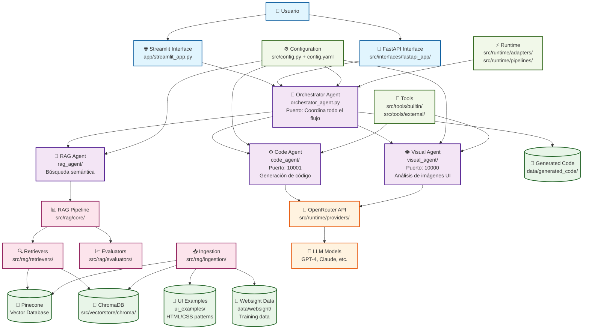

```mermaid
graph TB
    %% Usuarios y Interfaces
    USER[👤 Usuario]
    STREAMLIT[🌐 Streamlit Interface<br/>app/streamlit_app.py]
    FASTAPI[🔌 FastAPI Interface<br/>src/interfaces/fastapi_app/]
    
    %% Agente Orquestador Central
    ORCHESTRATOR[🎯 Orchestrator Agent<br/>orchestator_agent.py<br/>Puerto: Coordina todo el flujo]
    
    %% Agentes Especializados
    VISUAL[👁️ Visual Agent<br/>visual_agent/<br/>Puerto: 10000<br/>Análisis de imágenes UI]
    CODE[⚙️ Code Agent<br/>code_agent/<br/>Puerto: 10001<br/>Generación de código]
    RAG[🧠 RAG Agent<br/>rag_agent/<br/>Búsqueda semántica]
    
    %% Sistema RAG y Vectorstore
    RAG_PIPELINE[📊 RAG Pipeline<br/>src/rag/core/]
    RETRIEVERS[🔍 Retrievers<br/>src/rag/retrievers/]
    EVALUATORS[📈 Evaluators<br/>src/rag/evaluators/]
    INGESTION[📥 Ingestion<br/>src/rag/ingestion/]
    
    %% Bases de Datos y Storage
    PINECONE[(🌲 Pinecone<br/>Vector Database)]
    CHROMA[(🎨 ChromaDB<br/>src/vectorstore/chroma/)]
    
    %% Proveedores de LLM
    OPENROUTER[🤖 OpenRouter API<br/>src/runtime/providers/]
    LLM_MODELS[🧠 LLM Models<br/>GPT-4, Claude, etc.]
    
    %% Datos y Configuración
    CONFIG[⚙️ Configuration<br/>src/config.py + config.yaml]
    UI_EXAMPLES[(📄 UI Examples<br/>ui_examples/<br/>HTML/CSS patterns)]
    WEBSIGHT[(🎯 Websight Data<br/>data/websight/<br/>Training data)]
    GENERATED[(💾 Generated Code<br/>data/generated_code/)]
    
    %% Herramientas y Utilidades
    TOOLS[🔧 Tools<br/>src/tools/builtin/<br/>src/tools/external/]
    RUNTIME[⚡ Runtime<br/>src/runtime/adapters/<br/>src/runtime/pipelines/]
    
    %% Flujos de Usuario
    USER --> STREAMLIT
    USER --> FASTAPI
    
    %% Flujo Principal
    STREAMLIT --> ORCHESTRATOR
    FASTAPI --> ORCHESTRATOR
    
    %% Coordinación de Agentes
    ORCHESTRATOR --> VISUAL
    ORCHESTRATOR --> RAG
    ORCHESTRATOR --> CODE
    
    %% Flujo RAG
    RAG --> RAG_PIPELINE
    RAG_PIPELINE --> RETRIEVERS
    RAG_PIPELINE --> EVALUATORS
    RETRIEVERS --> PINECONE
    RETRIEVERS --> CHROMA
    
    %% Datos y Configuración
    CONFIG --> ORCHESTRATOR
    CONFIG --> RAG
    CONFIG --> VISUAL
    CONFIG --> CODE
    
    %% Ingesta de Datos
    INGESTION --> UI_EXAMPLES
    INGESTION --> WEBSIGHT
    INGESTION --> PINECONE
    INGESTION --> CHROMA
    
    %% Generación de Código
    CODE --> OPENROUTER
    OPENROUTER --> LLM_MODELS
    VISUAL --> OPENROUTER
    
    %% Almacenamiento de Resultados
    ORCHESTRATOR --> GENERATED
    
    %% Runtime y Herramientas
    RUNTIME --> ORCHESTRATOR
    TOOLS --> CODE
    TOOLS --> VISUAL
    
    %% Estilos
    classDef userInterface fill:#e1f5fe,stroke:#01579b,stroke-width:2px
    classDef agent fill:#f3e5f5,stroke:#4a148c,stroke-width:2px
    classDef storage fill:#e8f5e8,stroke:#1b5e20,stroke-width:2px
    classDef external fill:#fff3e0,stroke:#e65100,stroke-width:2px
    classDef data fill:#fce4ec,stroke:#880e4f,stroke-width:2px
    classDef system fill:#f1f8e9,stroke:#33691e,stroke-width:2px
    
    class USER,STREAMLIT,FASTAPI userInterface
    class ORCHESTRATOR,VISUAL,CODE,RAG agent
    class PINECONE,CHROMA,UI_EXAMPLES,WEBSIGHT,GENERATED storage
    class OPENROUTER,LLM_MODELS external
    class RAG_PIPELINE,RETRIEVERS,EVALUATORS,INGESTION data
    class CONFIG,TOOLS,RUNTIME system
```